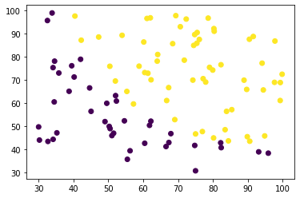
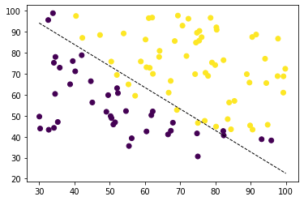

Machine Learning on Coursera Week 2 assignment involves building a logistic regression model to predict whether a student will be offered admissions to a university based on two test scores.

## Part 1: Getting the Data
As usual, we first load the dataset into a Python array.


```python
import matplotlib.pyplot as plt
import numpy as np
import matplotlib
import math
import scipy.optimize as op

path = '/Users/archit-p/sources/coursera/machine-learning/machine-learning-ex2/ex2/ex2data1.txt'
```


```python
f = open(path, 'r')

dataset = []

for line in f:
    fields = line.strip().split(',')
    fields[0] = float(fields[0])
    fields[1] = float(fields[1])
    fields[2] = int(fields[2])
    dataset.append(fields)
```

Each row of data consists of two test scores and a numeric value indicating which is 1 if the student was admitted and 0 otherwise.


```python
dataset[0:5]
```


    [[34.62365962451697, 78.0246928153624, 0],
     [30.28671076822607, 43.89499752400101, 0],
     [35.84740876993872, 72.90219802708364, 0],
     [60.18259938620976, 86.30855209546826, 1],
     [79.0327360507101, 75.3443764369103, 1]]


We transform the data into a `numpy` matrix with features and a `numpy` vector with results.


```python
# number of features
n = 2

# number of datapoints
m = len(dataset)

x = np.ones(shape=(m, n + 1))
y = np.zeros(m)

for i, d in enumerate(dataset):
    for j in range(n):
        x[i][1 + j] = dataset[i][j]
        y[i] = dataset[i][-1]
```


```python
x[0:5]
```


    array([[ 1.        , 34.62365962, 78.02469282],
           [ 1.        , 30.28671077, 43.89499752],
           [ 1.        , 35.84740877, 72.90219803],
           [ 1.        , 60.18259939, 86.3085521 ],
           [ 1.        , 79.03273605, 75.34437644]])


```python
y[0:5]
```


    array([0., 0., 0., 1., 1.])


We can visualize the data now using `matplotlib`.


```python
plt.scatter(x[:, 1], x[:, 2], c=y, cmap='viridis')
plt.show()
```


    

    


## Part 2: Logistic Regression and Gradient Descent

We will define a helper function to calculate the sigmoid function for a given parameter.


```python
def sigmoid(z):
    return 1 / (1 + math.exp(-z))
```


```python
sigmoid(0)
```


    0.5


Hypothesis and mean square error functions can be calculated given the feature vectors xi and the parameters theta. We define an additional function gradient which will be used for calculating the gradient given theta, x and y.


```python
def hypothesis(theta, xi):
    return sigmoid(np.matmul(np.transpose(theta), xi))
```


```python
def mse(theta, x, y):
    sum = 0
    for i in range(len(x)):
        sum -= y[i] * math.log(hypothesis(theta, x[i, :])) + (1 - y[i]) * math.log(1 - hypothesis(theta, x[i, :]))
    return sum / m
```


```python
def gradient(theta, x, y):
    res = np.empty(n + 1)
    for j in range(n + 1):
        sum = 0
        for i in range(len(x)):
            sum += x[i][j] * (hypothesis(theta, x[i, :]) - y[i])
        res[j] = sum / m
    return res
```


```python
mse(np.zeros(3), x, y)
```


    0.6931471805599458


```python
gradient(np.zeros(3), x, y)
```


    array([ -0.1       , -12.00921659, -11.26284221])


```python
result = op.minimize(fun = mse,
                        x0 = np.zeros(n + 1),
                        args = (x, y),
                        method = 'TNC',
                        jac = gradient);

theta = result.x
```


```python
hypothesis(theta, np.array([1, 45, 85]))
```


    0.7762906253511527


Using the minimized theta values, lets plot the decision boundary.


```python
c = -theta[0] / theta[2]
m = -theta[1] / theta[2]

xmin, xmax = 30, 100
xd = np.array([xmin, xmax])
yd = xd * m + c

plt.scatter(x[:, 1], x[:, 2], c=y, cmap='viridis')
plt.plot(xd, yd, 'k', lw=1, ls='--')
plt.show()
```


    

    


Having visualized the decision boundary, let us now see how accurate it is at predicting the outcomes.


```python
def predict(theta, x):
    predictions = np.zeros(len(x))
    for i in range(len(x)):
        predictions[i] = hypothesis(theta, x[i]) >= 0.5
    return predictions
```


```python
def accuracy(theta, x, y):
    predictions = predict(theta, x)
    cnt = 0
    for i in range(len(y)):
        cnt += y[i] == predictions[i]
    return cnt / len(y)
```


```python
accuracy(theta, x, y)
```


    0.89


We've achieved an 89% accuracy for the model. Looking at the decision boundary above, this might be the most accurate we can get using a straight line.

That was it on this assignment. We've seen how to use gradient descent to train a logistic regression model. The main difference here from a linear regression was the `gradient` function.
